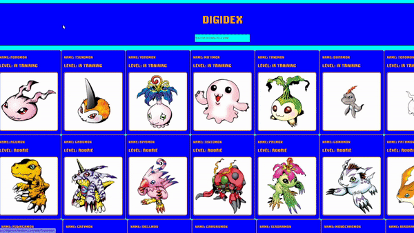

# digidex-react
## Entendendo o uso do ReactJS para a construção de sites e consumindo APIs com o mesmo.
No site em questão foi utilizado da biblioteca axios para consumir uma API retornando varios componentes.

##Tecnologias estudadas
- ReactJS
- Consumo de API
- Biblioteca axios
